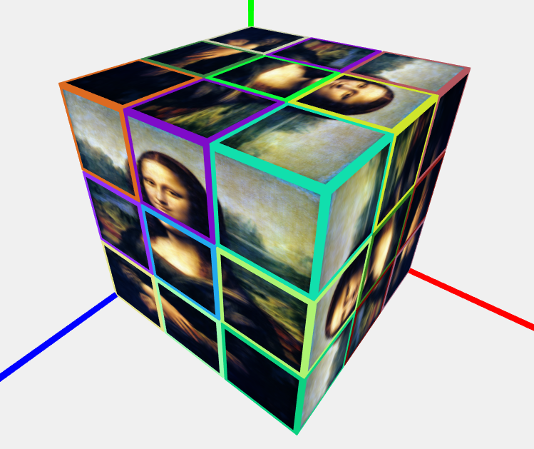
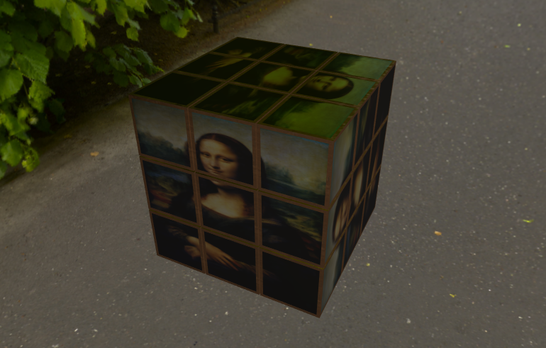
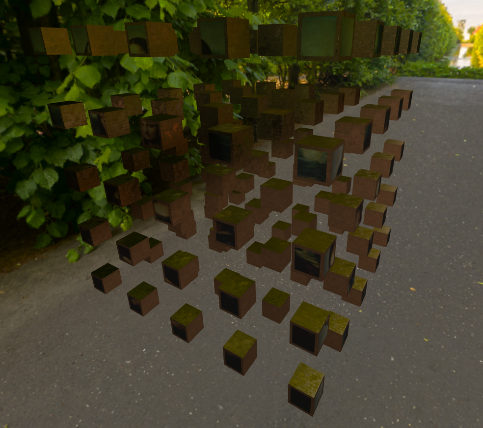
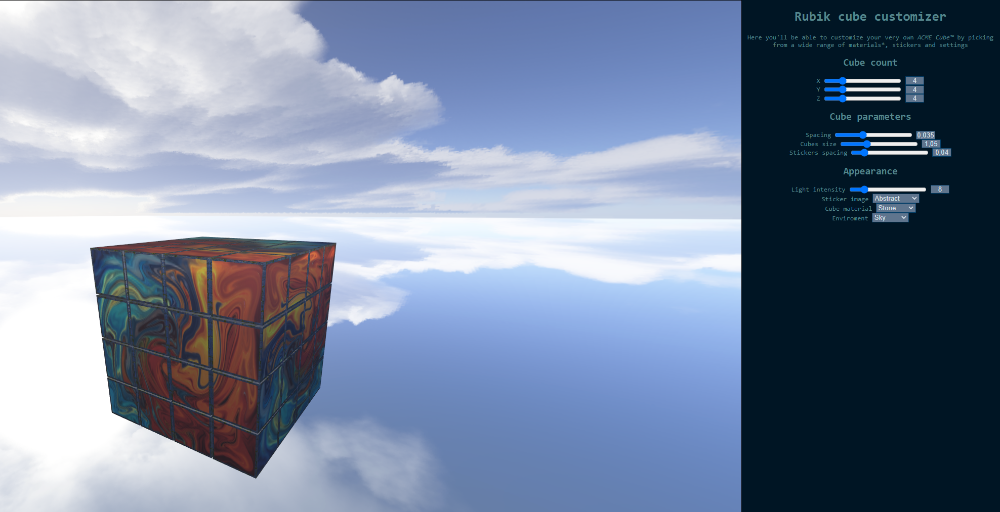

# The idea

The idea is to make a storepage that lets you design your own rubik's cube in, at the very least, size, per-cube material and per-cube sticker colors (possibly with support for textures)

It also could implement a way to visualize how the rotations would look

# Progress

**Day 1:** implemented a simple function that uses a few parameters (number of cubes per dimension, size of the cubes and spacing) to generate a basic rubik's cube

**Day 2:** added stickers to the cubes and a material brush that allows to change any clicked mesh into a set material

**Day 3:** updated sticker generation so that they do not end up flipped. Added proper UVs to the stickers to appy textures to them.

**Day 4:** added PBR shaders. Cubes and stickers use different shaders so that stickers don't need normal and specular maps

 

**Day 5:** after spending some time learning HTML and CSS (as i never used them before) i implemented a sidebar to customize the cube. I also changed some parts in the js code to support the customization UI

**Day 6:** decided to ditch the idea of per-cube materials because of time restraints, also fixed window resizing. Wrote the report on the project and fixed the journal. If i have some time i'll try to clean up the code and comment it a lot more as right now it's a mess due to me learning how to write html, css and js on the go