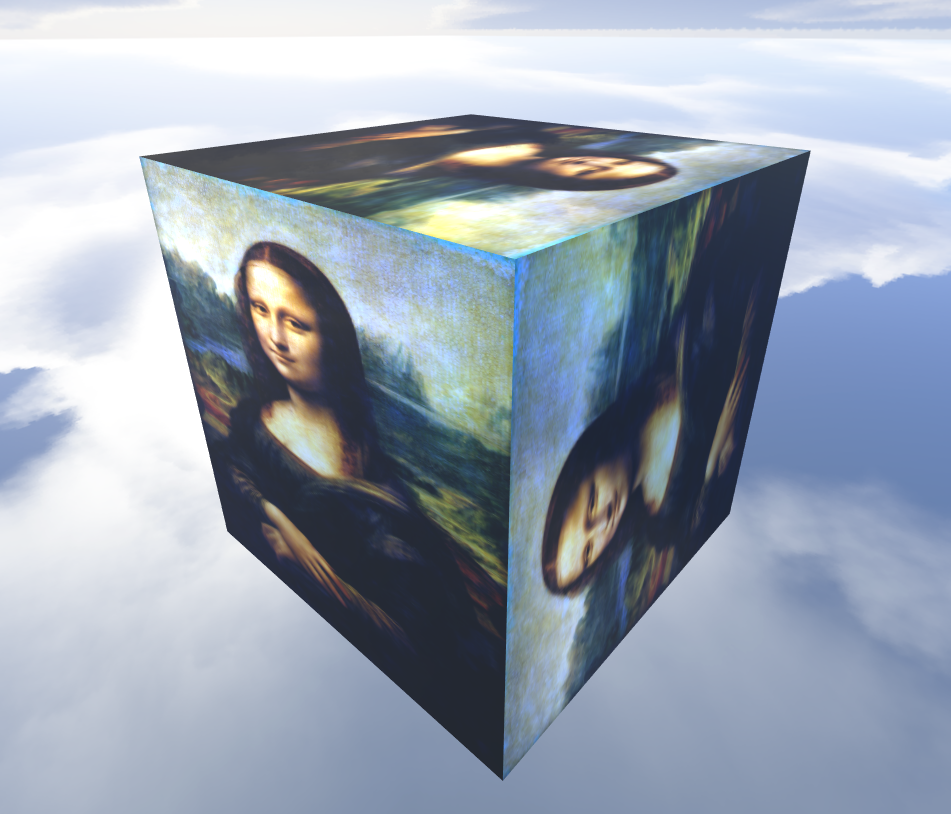
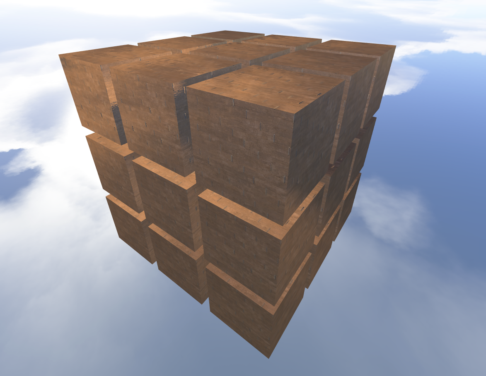
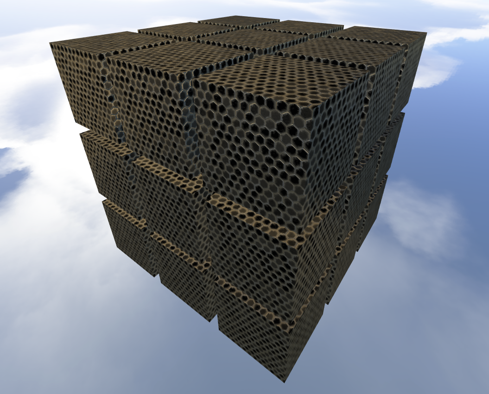

# _ACME Cube™_ customizer

This webapp allows to customize a rubik's cube by number of cubes, spacing between them, size, sticker margin, cube material and sticker texture.

It uses a mix of free textures found online and some scavenged from the example code of the course. To access those file the app requires a local server on the port 8080 for the project folder.

## Materials and shaders

This project uses two sets of shaders: one simpler for the stickers and one for the cubes.

The materials use the following PBR equations:

* Schlick approximation for Fresnel effect

* GGX/Trowbridge-Reitz for the normal distribution function

* Approximated Smith for the geometry factor

* Cook-Torrance microfaced specular model for the microfacet specular BRDF, using the previous three

* Lambertian diffuse

Both materials support an arbitrary amount of light sources (needs to be set in the shader before compilation), a diffuse map and an eviroment map. Additionally the cube material also uses a specular, roughness and normal map. For stickers cspec and roughness are uniform across the entire material rather than texture mapped for simplicity.

What follows are a bunch of examples of the aviable materials and a gif demonstrating the enviroment map:

 | 
:-----------------------------------------------:|:--------------------------------------------:
                | 

## The process

When i started this my only experience with js was the previous assignment for this course so i started by copypasting its code and quickly putting together a prototype

The first few things went by smoothly until it came to adding stickers to the cube. Initially i went with the lazy approach of simply creating 6 identical quads and then rotating them into their intended position but that turned out to be a nightmare for UV mapping so i scrapped that and went with generating the quads with the vertices already in the right positions, without the need for rotations

The next step was to implement the PBR shaders so i did just that by taking the shaders from the example code and modifying/mixing them together to make them have all the desired features. After some minor bugfixing this too went by smoothly

With that done it was now time to tackle the UI which is generally the one thing i'm very bad at in all of my projects. As already stated i had never created a webapp before so it was finally time to learn html and css and after half a day of experiments i managed to get a working UI. While doing all that i took the opportunity to move the js code to a seperate file and i wanted to do the same for the shaders but for some reason that would just break everything so i left the shaders in the html file

## Conclusions

Overall i'm quite satisfied with the end result but i find the code itself to be very messy because of my inexperience with the languages and the "learn things as you go" approach i had with it

I wish i could have spent more time on the actual "interactive 3D graphics" parts of the assignment rather than waste so much time on learning how to make webapps but i'm still happy i expanded my skillset